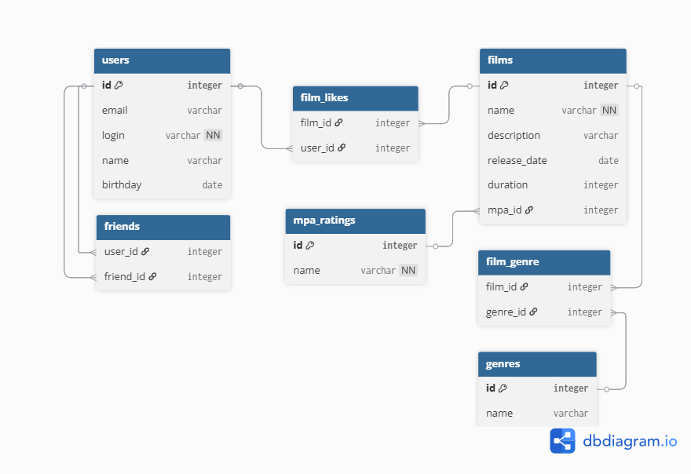

# Схема базы данных Filmorate



# **Примеры запросов для базы данных**

## Получение топ-10 самых популярных фильмов

Запрос возвращает список из 10 фильмов с наибольшим количеством лайков, отсортированный по популярности.

```sql
SELECT
    f.name,
    f.release_date,
    COUNT(fl.user_id) AS likes_count
FROM films f
LEFT JOIN film_likes fl ON f.id = fl.film_id
GROUP BY f.id, f.name, f.release_date
ORDER BY likes_count DESC
LIMIT 10;
```

## Получение всех фильмов определенного жанра

Запрос возвращает все фильмы, относящиеся к жанру "Комедия", отсортированные по дате выхода.

```sql
SELECT
    f.name,
    f.release_date,
    f.duration
FROM films f
INNER JOIN film_genre fg ON f.id = fg.film_id
INNER JOIN genres g ON fg.genre_id = g.id
WHERE g.name = 'Комедия'
ORDER BY f.release_date DESC;
```

## Получение списка друзей пользователя с статусом подтвержденной дружбы

Запрос возвращает всех друзей пользователя, где дружба подтверждена.

```sql
SELECT
    u.name,
    u.email
FROM users u
INNER JOIN friends f1 ON u.id = f1.friend_id
INNER JOIN friends f2 ON u.id = f2.user_id AND f2.friend_id = f1.user_id
WHERE f1.user_id = 1;